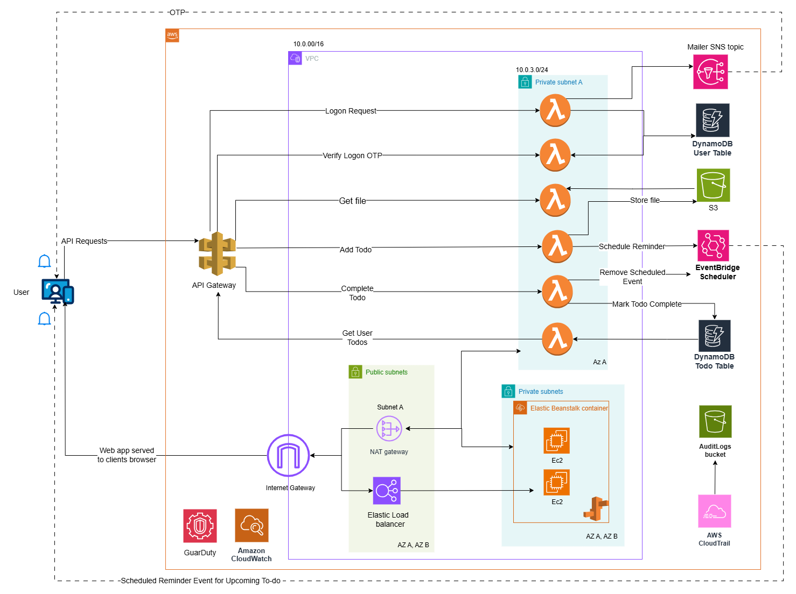

## About

A task manager and reminder web application using AWS. In the application the users can add their tasks and get reminders on their mail 1 hour before their task is scheduled. The users can also add a supporting document (a file, image etc.) while adding a task and then have an option to download it later. The web application 
doesn’t require any password, any user can be on boarded with just their email id and they will receive OTP to sign in to the application.  
A user once signed in will see a dashboard with a calendar which gives a holistic view to them, they can see the number of tasks they have added for each calendar day, and upon selecting a particular day of the month they will see the tasks details with the option to mark the task complete and download file for their task if they uploaded any. If a task is marked complete to reminder will be sent.  
This reminder/task manager web application is designed for anyone with an email address who needs help organizing their tasks and receiving timely reminders. 

### Technical Overview
The backend uses AWS Lambda for core business logic, while the Angular frontend is hosted on Elastic Beanstalk. Data is stored securely in DynamoDB, and user files are managed in S3. API Gateway routes all requests to backend services, with EventBridge and SNS handling task reminders. Security is ensured with private subnets for sensitive resources, encryption for data, and monitoring through CloudWatch, CloudTrail, and GuardDuty. The architecture balances security and accessibility while adhering to AWS Well-Architected Framework principles.

I have used a total of 7 categories of AWS services with a total of 13 services within these categories. 
1. Compute: 
    1. AWS Elastic Beanstalk  
    2. AWS Lambda 
2. Storage: 
    1. Amazon Simple Storage Service (S3) 
3. Networking and Content Delivery: 
    1. Amazon API Gateway  
    2. Amazon VPC 
    3. Elastic Load Balancing 
4. Database: 
    1. Amazon DynamoDB 
5. Application integration: 
    1. Amazon EventBridge 
    2. Amazon Simple Notification Service 
6. Management and Governance: 
    1. AWS CloudFormation 
    2. AWS CloudTrail   
    3. Amazon CloudWatch 
7. Security, identity, and compliance: 
    1. Amazon GuardDuty 

### Architecture

The following architecture diagram illustrates the ManageWithMe application’s serverless design, showcasing the integration of AWS services to deliver a secure, scalable, and highly available solution. Key components include API Gateway for routing requests, Lambda for backend processing, DynamoDB for data storage, and S3 for file management. The use of public subnets for external-facing resources like the Elastic Load Balancer and private subnets for sensitive backend services ensures a secure and isolated environment. EventBridge and SNS automate task reminders, while CloudWatch, CloudTrail and GuardDuty provide monitoring and security insights, adhering to AWS best practices.

## Built With

- [Angular](https://angular.dev//) - The web framework used
- [Node.js](https://nodejs.org/) - JavaScript runtime environment
- [npm](https://www.npmjs.com/) - Dependency Management
- [AWS](https://aws.amazon.com/?nc2=h_lg) - Serverless backend